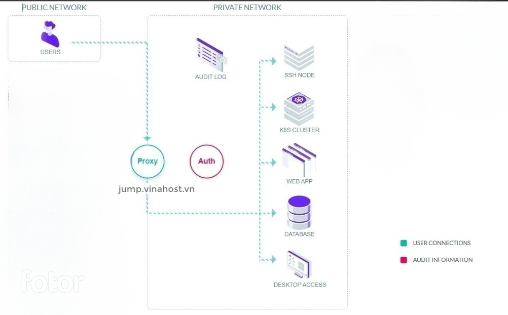
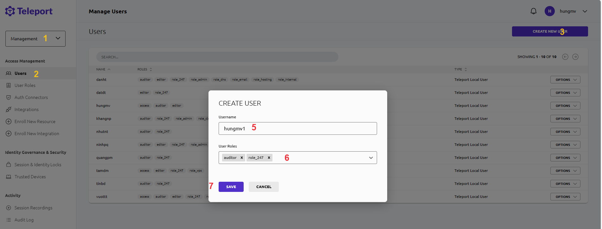
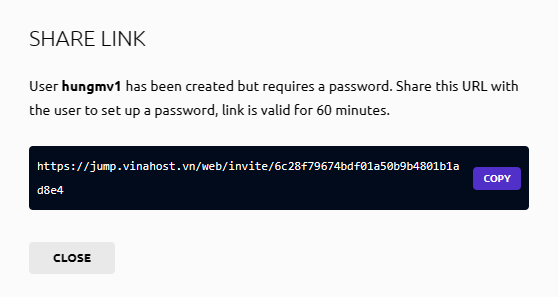
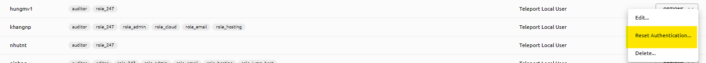
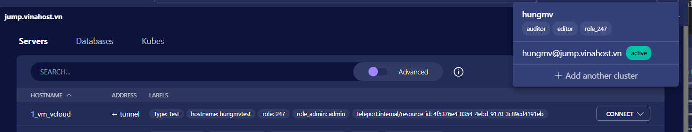
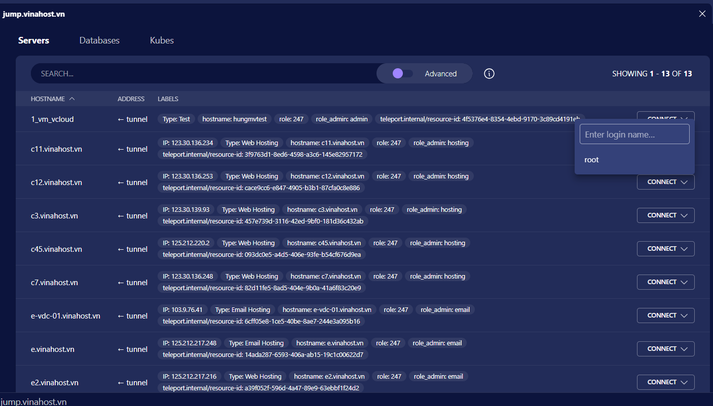
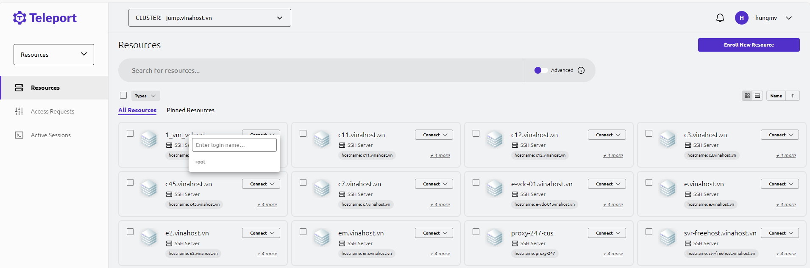

## Teleport
Teleport là một công cụ mã nguồn mở để cung cấp quyền truy cập không tin cậy vào các máy chủ và ứng dụng đám mây bằng SSH, Kubernetes và HTTPS. Nó có thể loại bỏ nhu cầu về VPN bằng cách cung cấp một cổng duy nhất để truy cập cơ sở hạ tầng máy tính thông qua SSH, cụm Kubernetes và ứng dụng đám mây thông qua proxy tích hợp.

## Cách Teleport hoạt động
Teleport cung cấp quyền truy cập an toàn vào SSH hoặc máy chủ Windows, máy tính để bàn Windows, cụm Kubernetes, cơ sở dữ liệu và ứng dụng web. Teleport được thiết lập dưới dạng daemon Linux hoặc trong Pod Kubernetes.

Về cơ bản Teleport là cơ quan cấp chứng chỉ và proxy truy cập đa giao thức, nhận dạng danh tính, triển khai các giao thức như SSH, RDP, HTTPS, Kubernetes API và nhiều cơ sở dữ liệu SQL và NoSQL. Nó hoàn toàn trong suốt đối với các công cụ phía máy khách.

### Kiến trúc của Teleport


- Quản lý người dùng truy cập vào nhiều ứng dụng, Server.
- Định nghĩa, định danh và phân quyền ở cấp độ cluster.
- Tất cả truy cập đến bất kỳ node nào phải luôn thông qua một proxy (SSH bastion).
- Tất cả người dùng và máy chủ phải tham gia cùng một cụm trước khi có thể cấp quyền truy cập.
- Để tham gia một cụm, cả người dùng và máy chủ phải xác thực và nhận chứng chỉ.
- Teleport Auth Service là CA của cụm, cấp chứng chỉ cho cả người dùng và máy chủ với tất cả các giao thức được hỗ trợ.

Mô hình này ngăn chặn, giảm thiểu các cuộc tấn công từ bên ngoài vào các server và loại bỏ vấn đề tin cậy khi sử dụng lần đầu. Điều này cũng cho phép người dùng liệt kê tất cả các máy chủ và các tài nguyên khác hiện có.

### Bảo mật
Một số phương thức bảo mật có sẵn với phiên bản Teleport Community Edition
- Xác thực đa yếu tố
- Có thể đăng nhập vào máy chủ, cụm Kubernetes, cơ sở dữ liệu, ứng dụng web và máy tính Windows desktop thông qua nhà cung cấp Đăng nhập một lần (SSO) như GitHub
- Kiểm soát truy cập các server, ứng dụng dựa theo vai trò(RBAC). Teleport cung cấp quyền kiểm soát chi tiết về việc ai có thể truy cập tài nguyên trong cơ sở hạ tầng cũng như cách họ có thể truy cập các tài nguyên đó.
- Kết hợp Firewall giới hạn truy cập đến Teleport. ```jump.vinahost.vn hiện tại đang dùng Uncomplicated Firewall (ufw) trên Ubuntu```


## Quản trị
Khi bắt đầu với Teleport Cluster mới sẽ có 3 role cho user admin là 
  - access: Có thể truy cập tất cả server được kết nối từ Teleport
  - auditor: Có thể xem log và Session Recordings.
  - editor: Có quyền quản trị Teleport

Các user được phân quyền truy cập vào các server dựa trên các role, các role này sẽ cấp quyền truy cập dựa  theo các label(nhãn) được gắn trên các server.

Thêm role:
  - Truy cập Management > User Roles > CREATE NEW ROLE để tạo role mới. 
  - Ví dụ về một role có tên `role_247` cấp quyền truy cập SSH vào các server được gắn nhãn `"role: 247"`
  ```
  kind: role
  metadata:
    # insert the name of your role here:
    name: role_247
  spec:
    allow:
      logins: ['{{internal.logins}}',root]
      node_labels:
        'role': '247'
      windows_desktop_labels:
        'role': '247'
      # Windows logins a user is allowed to use for desktop sessions.
      windows_desktop_logins:
      - '{{internal.windows_logins}}'
      - administrator

      rules:
      - resources:
        - event
        verbs:
        - list
        - read
      - resources:
        - session
        verbs:
        - read
        - list
        where: contains(session.participants, user.metadata.name)
    deny:
      logins: ['guest']

    options:
        max_session_ttl: 8h0m0s
  version: v7
  ```

Thêm User: 
  - Truy cập Management > User > CREATE NEW USER, nhập tên user và chọn role.
  
  

  - Sau khi tạo xong user sẽ nhận được một đường link tạo mật khẩu tồn tại trong 60 phút, gửi link này cho người dùng để tạo mật khẩu.
  
  

  - Có thể tạo lại link reset password để tạo mật khẩu mới khi quên mật khẩu hoặc link cũ hết hạn

  

Các user được cấp `role_247` này sẽ thấy nhìn thấy danh sách các server được phép truy cập và user được phép sử dụng để login SSH



### Session Recordings

Sau khi kết thúc môt session SSH Teleport sé ghi lại các thao tác trong session SSH đó và có thể xem lại tại Management > Session Recordings

### Audit Log
Audit Log Sẽ ghi lại các hoạt động trên Teleport như tạo thêm user, bắt đầu một session SSH, Certificate Issued,...

### Session & Identity Locks
Vô hiệu hóa người dùng teleport bị xâm nhập hoặc Ngăn chặn truy cập trong quá trình bảo trì cụm.

Khi vô hiệu hoá, Teleport sẽ từ chối các yêu cầu API mới và chấm dứt hoạt động kết nối với các phiên SSH, cơ sở dữ liệu và Kubernetes


### Cách truy cập, kết nối tới server bằng Teleport

Tải Client tại [https://goteleport.com/download/](https://goteleport.com/download/)

- tsh client: kết nối bằng command line
    - Đăng nhập vào teleport
        ```
        tsh login --proxy=jump.vinahost.vn --user=user_name 
        ```
    - Kết nối ssh bằng username được cho phép và hostname của server cần kết nối.
        ```
        tsh ssh username@host_name
        ```
    - Tham khảo thêm cách sử dụng [tsh Command Line Tool](https://goteleport.com/docs/connect-your-client/tsh/)

- [Teleport Connect:](https://goteleport.com/docs/connect-your-client/teleport-connect/) Ứng dụng hố trợ kết nối của Teleport



- [Web UI:](https://jump.vinahost.vn/) đăng nhập vào Teleport thông qua giao diện web và thực hiện các kết nối



  - Tham khảo các sử dụng web UI https://goteleport.com/docs/connect-your-client/web-ui/
